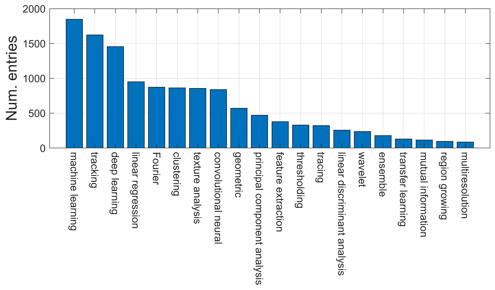
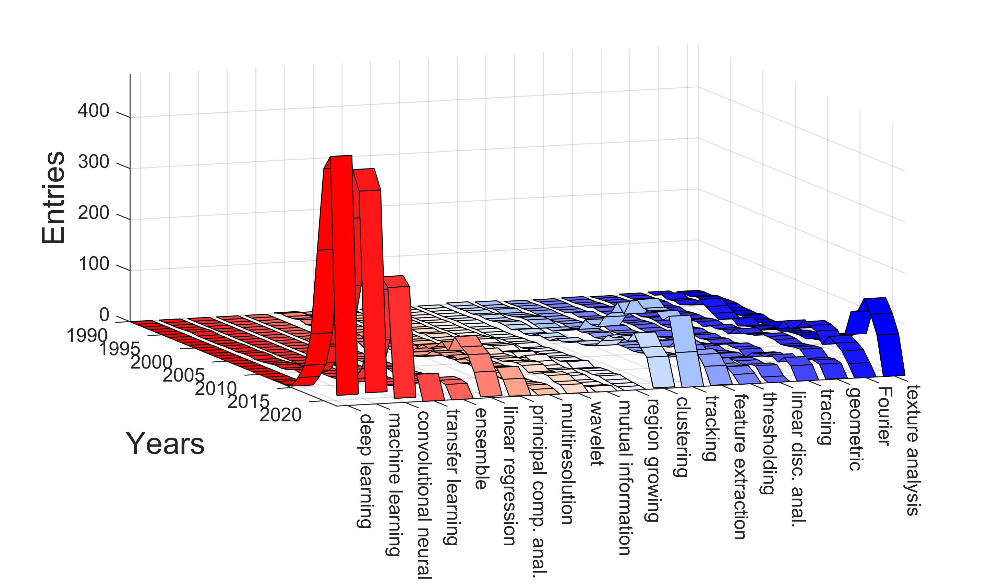
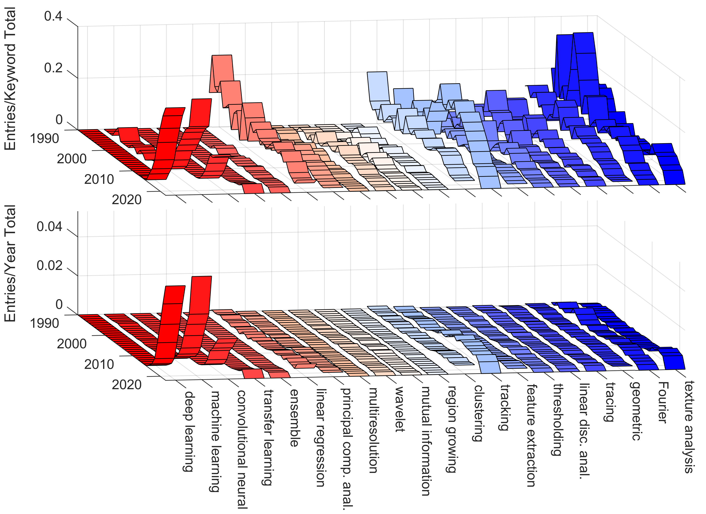
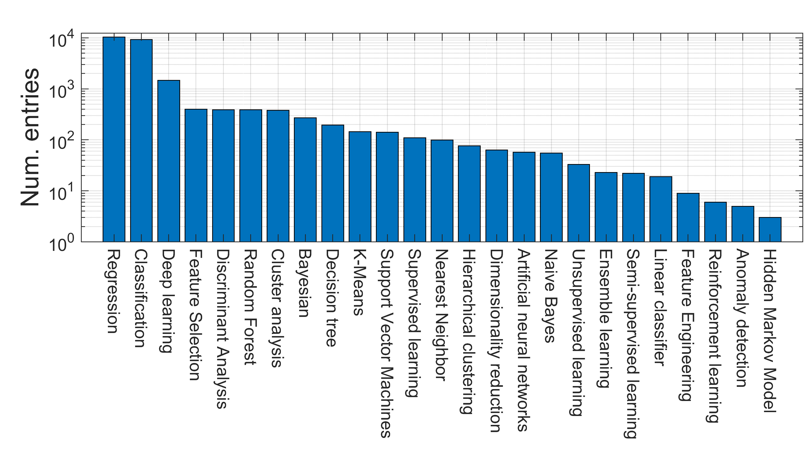
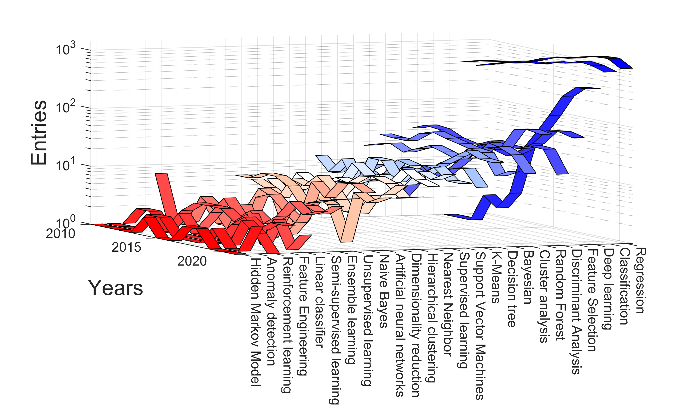
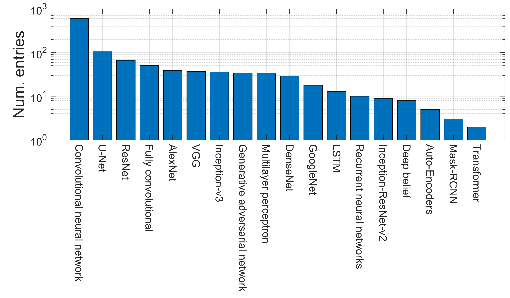

# Computational Image Analysis Techniques,Programming Languages and Software Platforms Used in Cancer Research: A Scoping Review
# Abstract
Background: Cancer-related research, as indicated by the number of entries in Medline, the National Library of Medicine of theUSA, has dominated medical literature. An important component of this research is the use of computational techniques to analyse the data produced by the many acquisition modalities. This paper presents a review of the computational image analysis techniques that have been applied to cancer data through mining Medline/PubMed entries with a combination of keywords. In addition, the programming languages and software platforms through which these techniques are applied are also reviewed.
# Code & Results
The code to automatically mine PubMed and generate these figures is placed in this repository

 

 

 

 

 

 

 

